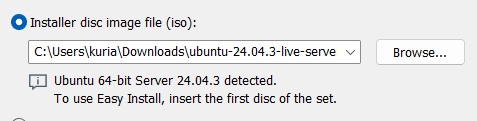

# Group 3 - DevOps Project Final ReadMe - Abuzzina Rink YuxinDen 

## Table of Contents
- [Overview](#overview)
- [Prerequisite](#prerequisites)
- [VM Server Installation](#vm-server-installation)
- [Docker Setup](#docker-setup)
- [Contributing](#contributing)
- [License](#license)
- [Clean up Commands](#clean-up-time)

## Overview
> This is our final submission for our final project. This is a small project called spring-clinic that shows what an end-to-end pipeline is like for covering CI/CD in Jenkins, SonarQube, OwaspZap, Promethus, Grafana, and deployment to a production VM Via Ansible. 

*Here is what each tool are are using does**
- **SonarQube**: Quality gate for code analysis  
- **Jenkins**: CI/CD automation server  
- **OWASP ZAP**: Dynamic security scanning   
- **Promethus**: Metrics Collection and Monitoring of Jenkins  
- **Grafana**: Takes Promethus to visual and create dishboards for pipeline, app, and infrastructure health. 
- **Production VM**: Target server where the Spring Petclinic app is deployed and accessed by users/tools  
- **Ansible**: Configuration management and deployment automation for Jenkins  

## prerequisites
Virtualizer info  
	VMware workstation 17 pro  
	Version 17.6.3 build-24583834   

Virtual machine OS : ubuntu-24.04.3-live-server-amd64

> The VM is so you do not configure this project on your host machine (e.g. Windows 11, MacOS 26 Tahoe, Lindux Fedora.) In a Real CI/CD pipeline you need to have production separation so when things break or crash you do not destroy your entire machine. Also for security OWASP Zap scans and Ansible on your host OS is not recommended. 

## vm-server-installation

#### Get a download of the Ubuntu Server 

https://ubuntu.com/download/server

(to get out of the virtual machine. hit the right control key otherwise known as the host key)
> Open your Virtual Machine and click "Create a New Virtual Machine"  
" what type of configuration do you want? Typical (Recommended)" -> hit next
"installer disc image file (iso)" -> make sure to select the correct ISO image & hit next


> "virtual Machine name" -> name it whatever you like. make sure your location of the machine is in the correct spot (its wherever on your system your vm files are stores or create a new file in your users folder for your user)


> Store as a single virtual disk file. Your Server should have at least 60 GB as your server will start at 8-12 GB as ready. If you can not afford to give that muc or simply do not want to. Use 35-40gb and when running this lab ensure you are running the commands found in (CleanUpTime)

> NEXT

>Click on customize hardware  
ensure that there is two CPU cores and a little more memory(ram) on your system (whatever you can afford to give)

> Click finish 

> NEXT!  
Try or install ubuntu server  

> Let the server do its thing  
English -> next
Keyboard config (leave it) Done -> next

>Ubuntu server (x) -> next
**slow down for the next part**
>Network configuration  
for some reason at this part your network configuration might not automatically configure. Use your arrow keys to enter into your ipv4 and enable automatic DHCP -> save and that should bring up your Ipv4. Your VM will switch it back to static after.

> NEXT!
You do NOT need a proxy config for this project. You only need this when you are in a corporate enviroment.

> NEXT! Ubuntu Archive Mirror for Ubuntu  
Leave this be. 

> NEXT! Guided Storage configuration 
Leave this be. DO NOT ENCRYPT FOR THIS PROJECT. Although encrypting is a good idea for protecting sensitive data at rest, we are not dealing with sensitive information or need it at this point. 

> Set your own user, pass, servername etc. (REMEMBER THIS.)

>NEXT! Storage Configuration (leave be. hit done)


>Next! Upgrade to Ubuntu Pro (Do not need. hit continue) 


>NEXT! SSH Configuration  
Enable "install OpenSSH Server" BUT DO NOT import at this stage. You will do this later. 


>Feature server snaps (leave be. hit done)  


>*Done! let it run and do its thing.* Dont freak out if it says failed to mount after selecting reboot. just press enter. 

>It should look like: 


***Take a snapshot here.***

>Click this clock plus button 


## Connecting my Virtual Machine to your host machine
##### When you are configuring jenkins, zap, etc. It is is easier to copy paste our commands from our github or running scripts frpm your host terminal than just typing it out on the production server. Plus the interface is 1000% better. 

> Login to the server with your username and password you created in the step above for this server. 
 and the ip a -> this allow you to see the ip information for this server 

 *The ip for your server is at the inet part without the /24* 

> check if ssh is enable by running the command in your ubuntu server

```sudo systemctl status ssh``` *For sudo (super user give admin privlages) type your password for the server. thi will happen multiple times* 


> enable if not
```sudo systemctl enable ssh --now```

>Check firewall status:

```sudo ufw status```

>If it shows inactive skip this 

>If it is active, allow SSH:

```sudo ufw allow ssh```
```sudo ufw reload```

> On your windows system command line terminal "cmd"

```ssh username@VMproductionserverIp``` -> put the inet ip in there. 

>type "yes" for the fingerprint and hit enter

***you're in!***

***Take another snapshot here.***
Things should be straight forward from here getting the project to come up. 


This is where you now run your commands unless stated otherwise. 

## pull from our git repo with docker install script first 

```sudo apt update``` -> always ensure you are up to date 

```sudo apt install -y git``` -> installing git and automactally saying yes

Getting the clone. go to the green <> code button in our workspace github.com/rosannadeng/spring-petclinic and then grab the link in https

or just copy this: 
```sudo git clone https://github.com/rosannadeng/spring-petclinic.git```

> then
```cd spring (PRESS TAB)```

>```sudo chmod +x install_docker.sh```

>```sudo ./install_docker.sh```  (this will install on the system not inside the file)

> nicee this should have put docker onto your system. 

> running into issues? use ```sudo chown $USER:$USER install_docker.sh``` then the sudo chmod command again. 


## docker-setup
#### **skip this if install_docker.sh ran docker hello world.**
##### For this section: you may have issues pulling from our git hub if you do not have docker installed. In essense we are trying to pull the git repo to boot up the docker-compose file in there. Our docker will put up a container that have all of our application code, libraries, java, and config files all into our mini self contained environment. This allows us to make outr system exact the same as everyone else's. However docker compose commands will not work if docker is not on the VM. If our docker script pull did not work, here is a instructional with a script:  


> Although you just installed ubuntu run an update to ensure you are up to date  

```sudo apt update```

> I used this step-by-step to set up docker. it does a great job in explaining what a container is etc. **step 6 needs to be 

https://linuxvox.com/blog/installing-docker-on-ubuntu-server/

> dont want to learn and copy/ paste? 
here is a quick script to paste into the command line

> step 1: ```touch install_docker.sh```

> step 2: ```sudo chmod +x install_docker.sh```

> step 3: ```sudo nano install_docker.sh```

>paste this script 

```
#!/bin/bash

set -e 

sudo apt update
sudo apt upgrade -y
sudo apt install -y apt-transport-https ca-certificates curl software-properties-common

curl -fsSL https://download.docker.com/linux/ubuntu/gpg \
    | sudo gpg --dearmor -o /usr/share/keyrings/docker-archive-keyring.gpg

echo "deb [arch=$(dpkg --print-architecture) \
signed-by=/usr/share/keyrings/docker-archive-keyring.gpg] \
https://download.docker.com/linux/ubuntu \
$(lsb_release -cs) stable" \
| sudo tee /etc/apt/sources.list.d/docker.list > /dev/null
sudo apt update
sudo apt install -y docker-ce docker-ce-cli containerd.io
sudo apt install -y docker-buildx-plugin docker-compose-plugin
sudo systemctl start docker
sudo systemctl enable docker
sudo docker run hello-world
```
> step 3: ```sudo ./install_docker.sh```


>Running into issues? possible you may need to tell ubuntu to install trusted ssl certificates so our server can get docker, but you may need to be able to add the repo for our version of ubuntu. 

```sudo apt install ca-certificates curl gnupg lsb-release```

> once you have followed through the installation until step 8:verify  install lets move on. It is good to read the entire documentation as there is good information in this. 

### end skip

## docker-build-images 

> for some reason maven is going to fail. here is the owrk around for it 

```sudo mkdir -p /etc/docker```

```sudo nano /etc/docker/daemon.json```

```sudo systemctl restart docker```

```sudo docker compose build maven-java25```


Now maven should be successful

>  ```sudo docker compose up -d```

> ```sudo docker compose up petclinic```

Once you get the container to run 

check if you have all your services running with
``` sudo docker ps```

here are the websites for all the containers 

Jenkins: http://yourip:8082/jenkins/

SonarQube: http://yourip:9000

Prometheus: http://192.168.47.133:9090

Grafana: http://192.168.47.133:3030

Offical PetClinc Site: http://192.168.47.137:8081/

*note: the petclinic section in your docker-compose.yml may be different due to updates <-ensure you are getting the most rescent tag from this repo * *https://hub.docker.com/r/springcommunity/spring-petclinic*

 >petclinic:
    image: springcommunity/spring-petclinic:3.5.6
    container_name: petclinic
    ports:
      - "8081:8080"
    networks:
      - devops-net

## Step 4: Configure SonarQube

#### 4.1 Access SonarQube Web Interface

1. Open your web browser
2. Go to: **http://localhost:9000**
3. Wait for SonarQube to fully start

#### 4.2 Initial Login

- **Username:** `admin`
- **Password:** `admin`
- Click **"Log in"**

#### 4.3 Change Password 

1. Enter:
   - **Old password:** `admin`
   - **New password:** (choose a strong password)
   - **Confirm password:** (same password)

#### 4.4 Generate Authentication Token

1. Click on your profile icon (top right corner, letter 'A')
2. Select **"My Account"**
3. Click on the **"Security"** tab
4. Under **"Generate Tokens"**:
   - **Name:** `jenkins`
   - **Type:** Select **"Global Analysis Token"**
   - **Expires in:** Select **"No expiration"**
5. Click **"Generate"**
6. **CRITICAL:** You'll see a token like `squ_xxxxxxxxx`
7. **Copy this tokeny**
8. Save it in a somewhere

---

### Step 5: Create Environment File with Token

#### 5.1 Create `.env` File

In your terminal, run:

```bash
# Make sure you're in the project directory
cd ~/Documents/spring-petclinic

# Create .env file with your token
cat > .env << 'EOF'
SONAR_AUTH_TOKEN=PASTE_YOUR_TOKEN_HERE
EOF
```
**Replace `PASTE_YOUR_TOKEN_HERE` with your actual token from Step 4.4**

Example:

```bash
cat > .env << 'EOF'
SONAR_AUTH_TOKEN=squ_1234567890abcdefghijklmnop
EOF
```

#### 5.2 Verify `.env` File

```bash
# Check the file was created
cat .env
# should be the same as you have
```

#### 5.3 Restart Services to Load Token

```bash
# Stop all services
docker compose down

# Start services again (they'll read the .env file)
docker compose up -d

```

#### 5.4 Verify Token Was Loaded

```bash
# Check if Jenkins has the environment variable
docker exec jenkins env | grep SONAR_AUTH_TOKEN

# You should see:
# SONAR_AUTH_TOKEN=squ_your_actual_token
```

---

## Jenkins configuration 

## 6.1 Access Jenkins Web Interface

1. Open your web browser
2. Go to: **http://localhost:8082/jenkins**
3. You'll see "Unlock Jenkins" page

#### 6.2 Get Initial Admin Password

In your terminal, run:

```bash
# Get the initial admin password
docker exec jenkins cat /var/jenkins_home/secrets/initialAdminPassword
```

**Expected output:** A long string like `a1b2c3d4e5f6g7h8i9j0k1l2m3n4o5p6`

1. Copy this password
2. Paste it into the Jenkins "Administrator password" 

#### 6.3 Install Plugins

1. Select **"Install suggested plugins"**


Select plug-in to install: Here is the configurations of the jenkins plugin


You should see this screen 


CLICK THE BOTTOM button to continue as admin, NOT ADMIN USER. We will create a user in a momment but you need to be able to access your admin account as well. 

Change your password

the system should log you out to prompt you again for the password. Log back in. 

if you forget your password go to the (#jenkinsadminpasswordreset) section

#### 6.4 Instance Configuration

1. **Jenkins URL:** Keep default `http://localhost:8082/jenkins/`
2. Click **"Save and Finish"**
3. Click **"Start using Jenkins"**

Go to tools 

> sqa_b17097ac7751fbed9b56d2fc2ecd9c1d684e5cad

#### 6.5 Configure SonarQube Server in Jenkins

**Option A: Verify Automatic Configuration (Recommended)**

1. Go to **"Manage Jenkins"** (left sidebar)
2. Click **"Configure System"**
3. Scroll down to **"SonarQube servers"** section
4. You should see:
   - Name: `SonarQubeServer`
   - Server URL: `http://sonarqube:9000`
   - Server authentication token: `sonar-token`

If you see this, **skip to next**. If not, continue with Option B.

**Option B: Manual Configuration**

1. Go to **"Manage Jenkins"** → **"Configure System"**
2. Scroll to **"SonarQube servers"**
3. Click **"Add SonarQube"**
4. Fill in:
   - **Name:** `SonarQubeServer` 
   - **Server URL:** `http://sonarqube:9000`
   - **Server authentication token:** Click **"Add"** → **"Jenkins"**
5. In the popup:
   - **Kind:** Select **"Secret text"**
   - **Scope:** Global
   - **Secret:** Paste your SonarQube token from Step 4.4
   - **ID:** `sonar-token`
   - **Description:** `SonarQube Authentication Token`
   - Click **"Add"**
6. Select `sonar-token` from the dropdown
7. Click **"Save"** at the bottom

#### 6.6 Verify Tools Configuration

1. Go to **"Manage Jenkins"** → **"Global Tool Configuration"** or **"Tools"** (in the new Jenkins UI)
2. Verify you see:
   - **Maven installations:** `Maven 3.9.5`
   - **JDK installations:** `JDK 25`

These are auto-configured by `jenkins.yaml`.

---

## configure prometheus 


Step 1 Ensure Promethus is running with ```sudo docker ps```
step 2 go to `http://yourVMip:9000` for sonarqube and login with admin
step 3 edit the prometheus.yml file so your permissions match

sudo nano prometheus

```job_name: sonarqube
    metrics_path: /api/monitoring/metrics
    basic_auth:
      username: admin             
      password: YOUR_ADMIN_PASSWORD ,- whatever you set it too
    static_configs:
      - targets:
          - sonarqube:9000
```

save and exit out of the file ctrl-x yes enter

```sudo docker compose restart prometheus```

check if prometheus is all green and prometheusm jenkins and sonarqube are all up: http://yourVMIp:9090/targets?search=


## configure grafana-dashboards

your containers should all be up, but you should still check with sudo docker ps 

if all containers are runnig so to your granfana 

http://yourVmIp:3030

configure your data source

go to 


then ensure your dashboard can get to your prometheus container using 
http://prometheus:9090


now do to dashboards by clicking the left hand stack and clicking dashboards 


or 


create new dashboards -> datasourse prometheus 

Click on the add query and then select a metric with one of the proconfigured ones. run quries to see if it works. 

save and name it correctly


great you now have a dashboard.


## jenkinsadminpasswordreset

You lost your admin password

Confirm you can't get the file for the intinital password either
```sudo docker exec jenkins cat /var/jenkins_home/secrets/initialAdminPassword```
Confirm the file does not excist 
```sudo docker exec jenkins ls /var/jenkins_home/init.groovy.d```
Make it if it doesn't
```sudo docker exec jenkins mkdir -p /var/jenkins_home/init.groovy.d```

```cd /tmp```
```cat > createAdmin.groovy```

copy this file into the container
```sudo docker cp /tmp/createAdmin.groovy jenkins:/var/jenkins_home/init.groovy.d/createAdmin.groovy```

```sudo docker restart jenkins```  <-runs the script 


